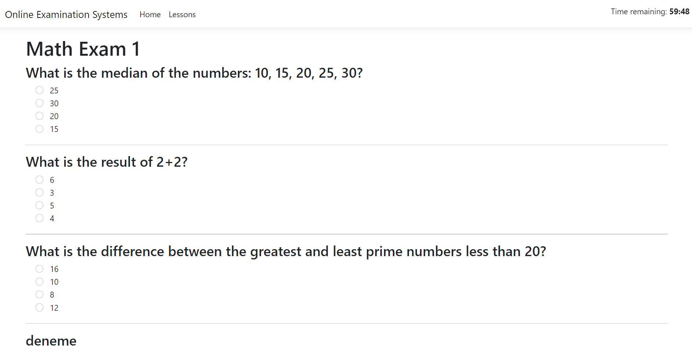

# Online Examination System

This project is a RESTful API built with .NET 8 and an ASP.NET MVC UI, designed for managing online examinations. The system uses JWT authentication for secure access and Dapper for efficient database operations. To ensure clean, maintainable code, a generic repository pattern is implemented for Dapper, and Fluent Validation is used for validating user inputs.

## Features

User Management

- Different user roles: Admin, Academic, and Student.
- Unique login credentials (email and password) for each user.
- JWT-based authentication for secure access.
  
Access Control
- Academics can create, edit, and publish exams.
- Admins can manage user permissions and assign courses.
- Students can participate in exam sessions and answer questions.

Exam Creation & Management
- Academics can create exams with unique IDs, a specified number of questions, start times, and durations.
- Exams are timed and can automatically start at the designated time.

Exam Sessions
- A separate session is initiated for each exam.
- Students can join exam sessions and answer multiple-choice questions during specified time intervals.

## Screenshots

**Admin User Edit**
   

**Academican Exam**
   

**Academican Question**
   

**Student Exam List**
   

**Student Exam Page**
   


## How to Run

**Requirements**
- .NET 8 SDK must be installed.
- IDE such as Visual Studio 2022 or Visual Studio Code.
- SQL Server installed on your machine.
  
**Step 1: Import the Database Dump File**
- Open SQL Server Management Studio (SSMS) and connect to your SQL Server instance.
- Right-click on the "Databases" folder and select "Restore Database."
- Browse and select the OnlineExaminationSystems.bak file from the project directory.
- Follow the prompts to restore the database.
  
**Step 2: Configure the Database Connection String**
- Modify the appsettings.json file in the ASP.NET Core API project to update the connection string
```
{
  "ConnectionStrings": {
    "DefaultConnection": "Data Source=localhost;Initial Catalog=OnlineExaminationSystems;Integrated Security=True;"
  }
}
```

**Step 3: Run the Projects**
- Running in Visual Studio
- Open the solution (.sln file) in Visual Studio.
- In Solution Explorer, right-click on both the API and MVC projects and select "Set as StartUp Projects."
- Press F5 or click the "Run" button to start both the API and MVC projects.
  
**Step 4: Test the Application**

Open your browser and navigate to the following URLs:

- API Swagger UI: http://localhost:5000/swagger/index.html
- ASP.NET MVC UI: http://localhost:5001

Login with the admin credentials:

- Email: admin@admin.com
- Password: admin
  
If both applications are running successfully, you're all set!
